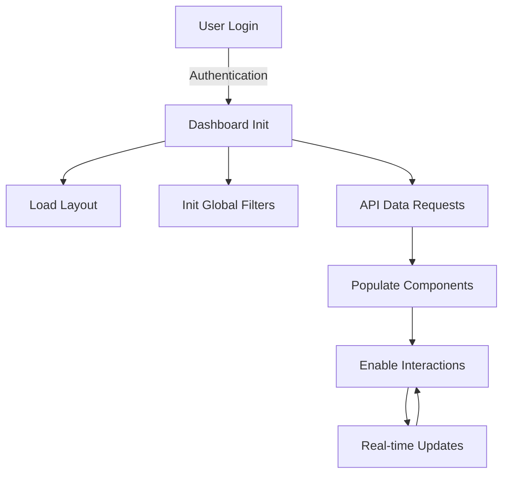

###  4: Website Flow and API Integration

### Website Flow

1. User Authentication:
   - User arrives at login page
   - Authenticates via Google SSO or email/password
   - Upon successful authentication, user is redirected to dashboard

2. Dashboard Initialization:
   - Main layout components are loaded (header, sidebar, content area)
   - Placeholder loaders are displayed for data-dependent components
   - Global filters and search functionality are initialized

3. Data Loading:
   - API calls are made to retrieve data for each dashboard component
   - Components are populated with data as it becomes available
   - Loading indicators are replaced with visualizations

4. User Interactions:
   - User can interact with individual components (e.g., filtering, sorting)
   - Global filters affect multiple components simultaneously
   - Clicking on certain elements (e.g., customer names) may load detailed views

5. Real-time Updates:
   - WebSocket connections maintain real-time data for applicable components
   - Users receive notifications for significant data changes



### API Integration

The dashboard integrates with backend APIs to fetch data for each component. Here's a detailed explanation of the API integration:

1. KPIs:
   Endpoint: `/kpis`
   Data: Aggregated metrics (total_lifetime_value, total_orders, avg_satisfaction_score, campaign_response_rate)
   Update Frequency: Real-time via WebSocket

2. Customer Segments:
   Endpoint: `/customer_segments`
   Data: Distribution of customer_segment field
   Update Frequency: Daily

3. Monthly Revenue:
   Endpoint: `/monthly_revenue`
   Data: Aggregated total_lifetime_value per month
   Update Frequency: Monthly with real-time option

4. Top Customers:
   Endpoint: `/top_customers`
   Data: customer_id, first_name, last_name, total_lifetime_value (top 5)
   Update Frequency: Daily

5. Product Category Performance:
   Endpoint: `/product_category_performance`
   Data: Aggregated total_lifetime_value per favorite_category
   Update Frequency: Weekly

6. Customer Satisfaction:
   Endpoint: `/customer_satisfaction`
   Data: Overall avg_satisfaction_score
   Update Frequency: Real-time

7. Churn Risk:
   Endpoint: `/churn_risk`
   Data: Distribution of churn_risk field
   Update Frequency: Daily

8. RFM Segmentation:
   Endpoint: `/rfm_segmentation`
   Data: days_since_last_purchase, total_orders, total_lifetime_value
   Update Frequency: Weekly

API Response Handling:
- Implement error handling for failed API calls
- Use loading states during data fetching
- Transform API responses to match component data structures

Data Refresh Strategies:
- Use polling for components with daily or weekly updates
- Implement WebSocket connections for real-time components
- Allow manual refresh option for all components

```javascript
const apiEndpoints = {
  kpis: '/kpis',
  customerSegments: '/customer_segments',
  monthlyRevenue: '/monthly_revenue',
  topCustomers: '/top_customers',
  productCategoryPerformance: '/product_category_performance',
  customerSatisfaction: '/customer_satisfaction',
  churnRisk: '/churn_risk',
  rfmSegmentation: '/rfm_segmentation'
};

async function fetchData(endpoint) {
  try {
    const response = await fetch(apiEndpoints[endpoint]);
    if (!response.ok) throw new Error('Network response was not ok');
    return await response.json();
  } catch (error) {
    console.error('Error fetching data:', error);
    // Implement fallback or error state in UI
  }
}

// Example usage
fetchData('kpis').then(data => updateKPIComponent(data));
```

This comprehensive design document provides a detailed guide for UI developers to build a robust and user-friendly CDP application. It incorporates the CDP schema, insights from developer discussions, and the data flow represented in the Sankey diagram to ensure a cohesive and efficient implementation.

# Cloud-Based Application Architecture

## Overview

This architecture describes a modern, cloud-based application utilizing various Google Cloud Platform (GCP) services for scalability, security, and efficient data processing.

### Components

#### Client-Facing Layer

1. Client: The end-user interface
2. Cloud Armor: Provides web application firewall and DDoS protection
3. Cloud Load Balancer: Distributes incoming traffic and performs SSL termination
4. Cloud CDN: Content Delivery Network for faster content delivery

#### Compute Layer

1. App Engine (Frontend): Hosts the React + Vite frontend application
2. Cloud Run (Backend API): Runs the backend API using Gunicorn + Uvicorn

#### Data Storage Layer

1. Cloud SQL (PostgreSQL): Relational database for structured data
2. Cloud Firestore: NoSQL database for flexible, scalable data storage

#### Data Processing Layer

1. Pub/Sub: Messaging service for event-driven systems
2. Cloud Functions: Serverless compute for event-driven processing
3. BigQuery: Data warehouse for analytics and large-scale data processing

#### Security & Configuration Layer

1. Secret Manager: Securely stores and manages sensitive information
2. Identity Platform: Manages user authentication and identity
3. Cloud KMS: Key Management Service for cryptographic operations
4. VPC Network: Virtual Private Cloud network containing various services

#### Monitoring & Scheduling

1. Cloud Operations: Provides monitoring and logging for various components
2. Cloud Scheduler: Manages scheduled tasks and jobs

#### Data Flow

1. Client requests are first processed by Cloud Armor for security.
2. Requests then pass through the Cloud Load Balancer, which terminates SSL.
3. Cloud CDN serves cached content when possible.
4. Requests are routed to either App Engine (frontend) or Cloud Run (backend API).
5. The backend API interacts with Cloud SQL, Firestore, and Pub/Sub as needed.
6. Pub/Sub triggers Cloud Functions for event-driven processing.
7. Cloud Functions can interact with BigQuery for data analytics.

#### Security Measures

1. HTTPS is used for all external communications.
2. SSL/TLS is used for internal service communications.
3. Secret Manager securely stores sensitive information.
4. Identity Platform manages user authentication.
5. Cloud KMS is used for key management.
6. All services are contained within a VPC Network for additional security.

#### Monitoring and Management
1. Cloud Operations provides monitoring and logging capabilities for most components in the architecture, ensuring visibility into the system's performance and health.

#### Scalability and Performance

1. Cloud Load Balancer and Cloud CDN ensure efficient distribution of traffic and content.
2. App Engine and Cloud Run provide scalable compute resources.
3. Cloud SQL and Firestore offer scalable data storage solutions.
Pub/Sub and Cloud Functions allow for scalable, event-driven processing.

This architecture provides a robust, secure, and scalable foundation for modern cloud-based applications, leveraging various GCP services to meet diverse requirements.

