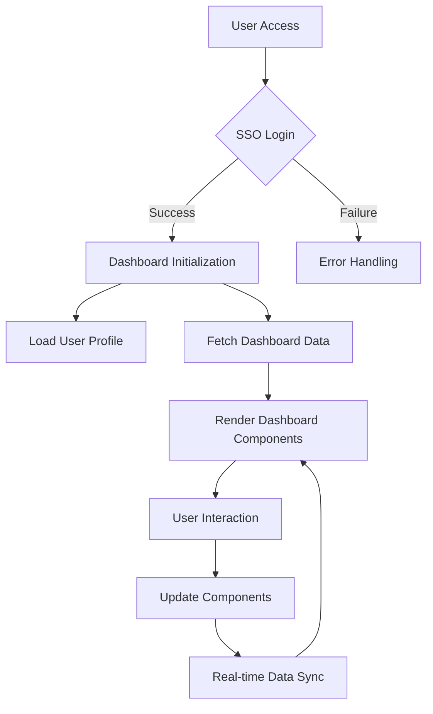

###  4: Website Flow and API Integration

### Website Flow

1. User Journey:
   - User accesses the application URL
   - SSO login screen is presented
   - Upon successful authentication, user is redirected to the dashboard
   - Dashboard initializes and loads user-specific data
   - User interacts with various components, triggering updates and data fetches

2. Authentication to Dashboard Transition:
   - After successful SSO, retrieve user token
   - Use token to fetch user profile and permissions
   - Initialize dashboard state based on user role and preferences

3. Dashboard Initialization:
   - Load user preferences (layout, favorite metrics)
   - Fetch initial data for all dashboard components
   - Display loading states (skeletons) while data is being retrieved

4. User Interactions:
   - Handle filtering, sorting, and drill-down actions
   - Update affected components based on user interactions
   - Manage state updates efficiently to maintain performance

### API Integration

API Endpoints:
- `/kpis`: Fetch key performance indicators
- `/customer_segments`: Retrieve customer segment distribution
- `/monthly_revenue`: Get monthly revenue trends
- `/top_customers`: Fetch top customers by lifetime value
- `/product_category_performance`: Get product category performance data
- `/customer_satisfaction`: Retrieve customer satisfaction scores
- `/churn_risk`: Fetch churn risk distribution
- `/rfm_segmentation`: Get RFM segmentation data

Data Fetching Strategy:
1. Initial Load:
   - Parallel API calls for all dashboard components
   - Use React Query for efficient data fetching and caching

2. Real-time Updates:
   - Implement WebSocket connections for real-time data (e.g., KPIs)
   - Use polling for less frequently updated data (e.g., monthly revenue)

3. User-triggered Updates:
   - Fetch data on-demand for user interactions (e.g., filtering, drill-downs)
   - Implement debouncing for search inputs to reduce API calls

Error Handling:
- Implement retry logic for failed API requests
- Display user-friendly error messages with options to refresh or contact support
- Log errors to a monitoring service for debugging and improvement

Data Transformations:
- Process API responses to match the required format for each visualization component
- Implement data normalization to ensure consistency across different data sources

### Data Refresh and Real-time Updates

1. Real-time Data Strategy:
   - Use WebSockets for critical real-time updates (e.g., KPIs, customer satisfaction)
   - Implement Server-Sent Events for one-way real-time updates

2. Polling Mechanism:
   - Set up intelligent polling for less frequently updated data
   - Adjust polling intervals based on user activity and data volatility

3. Optimistic Updates:
   - Implement optimistic UI updates for improved perceived performance
   - Reconcile with server data once the API response is received

4. Caching and Invalidation:
   - Use React Query's caching mechanism to reduce unnecessary API calls
   - Implement cache invalidation strategies to ensure data freshness

5. Background Sync:
   - Utilize service workers for background data synchronization
   - Update cached data when the application is not in active use

By following this comprehensive design document, UI developers will have a clear roadmap for implementing a robust, user-friendly, and performant Customer 360 CDP application that effectively utilizes the provided schema and incorporates insights from the development team discussions.

# Cloud-Based Application Architecture

## Overview

This architecture describes a modern, cloud-based application utilizing various Google Cloud Platform (GCP) services for scalability, security, and efficient data processing.

### Components

#### Client-Facing Layer

1. Client: The end-user interface
2. Cloud Armor: Provides web application firewall and DDoS protection
3. Cloud Load Balancer: Distributes incoming traffic and performs SSL termination
4. Cloud CDN: Content Delivery Network for faster content delivery

#### Compute Layer

1. App Engine (Frontend): Hosts the React + Vite frontend application
2. Cloud Run (Backend API): Runs the backend API using Gunicorn + Uvicorn

#### Data Storage Layer

1. Cloud SQL (PostgreSQL): Relational database for structured data
2. Cloud Firestore: NoSQL database for flexible, scalable data storage

#### Data Processing Layer

1. Pub/Sub: Messaging service for event-driven systems
2. Cloud Functions: Serverless compute for event-driven processing
3. BigQuery: Data warehouse for analytics and large-scale data processing

#### Security & Configuration Layer

1. Secret Manager: Securely stores and manages sensitive information
2. Identity Platform: Manages user authentication and identity
3. Cloud KMS: Key Management Service for cryptographic operations
4. VPC Network: Virtual Private Cloud network containing various services

#### Monitoring & Scheduling

1. Cloud Operations: Provides monitoring and logging for various components
2. Cloud Scheduler: Manages scheduled tasks and jobs

#### Data Flow

1. Client requests are first processed by Cloud Armor for security.
2. Requests then pass through the Cloud Load Balancer, which terminates SSL.
3. Cloud CDN serves cached content when possible.
4. Requests are routed to either App Engine (frontend) or Cloud Run (backend API).
5. The backend API interacts with Cloud SQL, Firestore, and Pub/Sub as needed.
6. Pub/Sub triggers Cloud Functions for event-driven processing.
7. Cloud Functions can interact with BigQuery for data analytics.

#### Security Measures

1. HTTPS is used for all external communications.
2. SSL/TLS is used for internal service communications.
3. Secret Manager securely stores sensitive information.
4. Identity Platform manages user authentication.
5. Cloud KMS is used for key management.
6. All services are contained within a VPC Network for additional security.

#### Monitoring and Management
1. Cloud Operations provides monitoring and logging capabilities for most components in the architecture, ensuring visibility into the system's performance and health.

#### Scalability and Performance

1. Cloud Load Balancer and Cloud CDN ensure efficient distribution of traffic and content.
2. App Engine and Cloud Run provide scalable compute resources.
3. Cloud SQL and Firestore offer scalable data storage solutions.
Pub/Sub and Cloud Functions allow for scalable, event-driven processing.

This architecture provides a robust, secure, and scalable foundation for modern cloud-based applications, leveraging various GCP services to meet diverse requirements.

